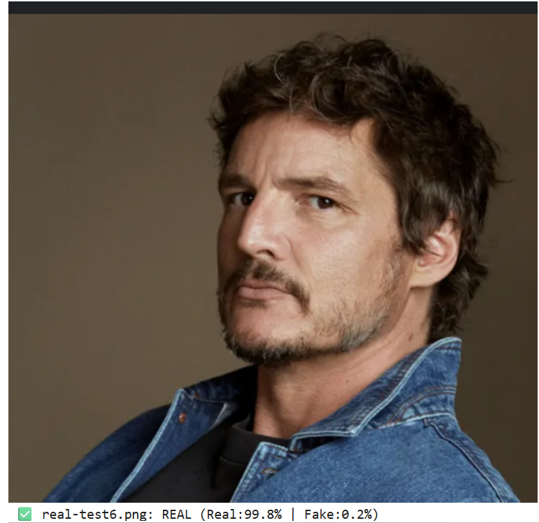
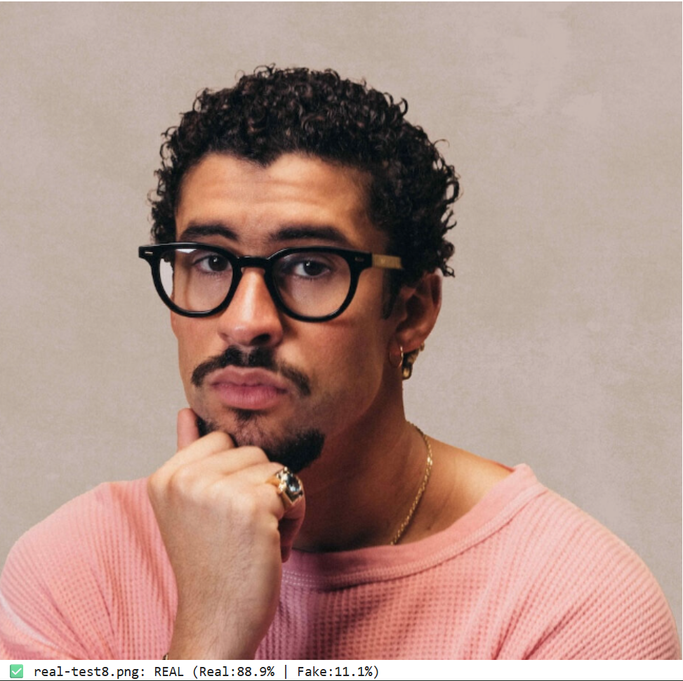
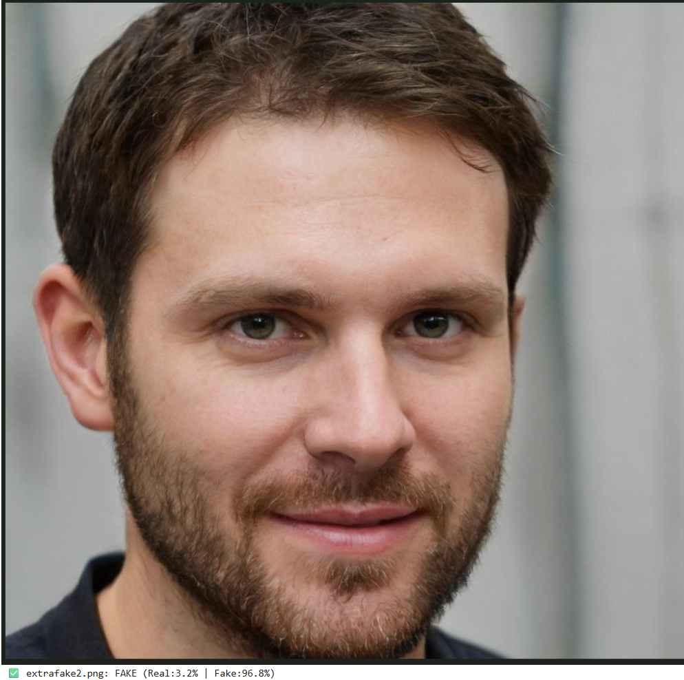
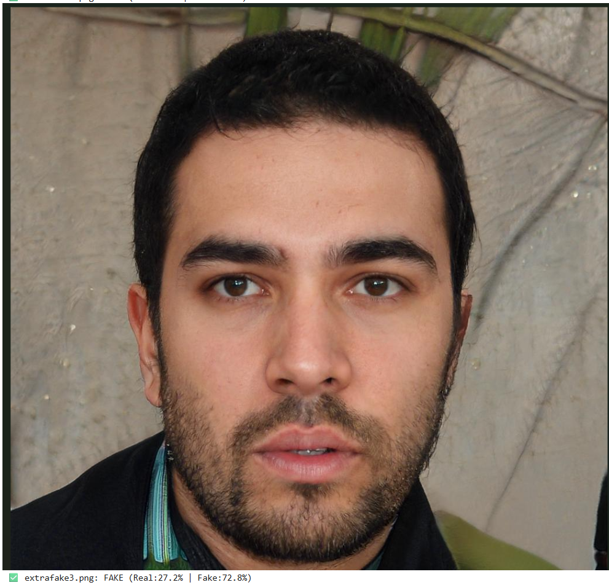

# 🧠 Image-Based Face Spoof Detection using Multi-Feature Fusion

This project presents a robust image-based face anti-spoofing system that integrates multiple visual features—including texture, depth, facial patches, and boundary cues—into a single fused representation. These features, both handcrafted and learned, are extracted from static RGB images and passed to a lightweight Multi-Layer Perceptron (MLP) classifier to determine whether the input is real or spoofed.

---

## 📂 Dataset — `balanced_dataset/`  
**Download**: [Google Drive](https://drive.google.com/file/d/1p4gV3Z2x-2bUGVzhQc6v4hOnXpInGXbQ/view?usp=drive_link)

This dataset includes a balanced mix of real and fake face samples from:

- **Celeb-DF**  
- **DeepFakeDetection (DFD)**
- **Portrait Generation by InstantID** Stable Diffusion + LoRA finetune ×370
- Additional fakes generated using *ThisPersonDoesNotExist* (TPDNE) x 100 (A variant of GAN2), Canva(stable diffusion) x50,
- and images cropped from physical media ×150

To reduce overfitting:
- Data is split by person ID using `Celeb_ID_Split.py` and `DFD_ID_Split.ipynb`  
- Frame selection is randomly shuffled to avoid pose redundancy  
- Each identity is subsampled to ensure manageable size

Original full datasets:
- https://www.kaggle.com/datasets/reubensuju/celeb-df-v2  
- https://www.kaggle.com/datasets/sanikatiwarekar/deep-fake-detection-dfd-entire-original-dataset

## Project Structure
<pre>
Spoofing/
├── balanced_dataset/              # Dataset (real + fake from multiple sources)
├── Celeb_ID_Split.py              # Person-based ID split script for CelebDF
├── DFD_ID_Split.ipynb             # Person-based ID split for DeepFakeDetection
├── frame_extraction_celeb.py      # Extract frames from CelebDF videos
├── frame_extraction_dfd.ipynb     # Extract frames from DFD
├── improved_deepfake_detector.pth # Trained PyTorch model (MLP-based)
├── spoofing_model.ipynb           # Full pipeline: loading features, training, evaluation, testing
├── requirements.txt               # Python dependencies
├── readme.md                      # This file
└── .keep                          # Empty file to preserve directory structure
</pre>


**Quick Start Instructions**:

1. **Install dependencies**  
   Run this command in your terminal:  
   ```bash
   pip install -r requirements.txt
2. Place the extracted dataset in the root directory as `balanced_dataset/`  
3. Run the notebook: `spoofing_model.ipynb`

---

## 🚀 Final Implementation Details

### ✅ Texture Analysis
- **Backbone**: ResNet18  
- **Preprocessing**:
  - Contrast enhancement using CLAHE (`clipLimit=3.0`, `tileGridSize=(8×8)`)  
  - Multi-scale Sobel filtering (`ksize=3` and `5`) to emphasize fine-grained texture and edge information  
- **Output**: ResNet18 features extracted from the enhanced grayscale input (converted to 3-channel)

---

### 🧩 Facial Patch Extraction
- **Landmark Detection**: MediaPipe (refined mesh)
- **Extracted Regions**:
  - Eyes (left/right)  
  - Nose  
  - Mouth  
  - Cheeks (left/right)  
  - Forehead  
- Each region is cropped with padding, normalized to 64×64, and passed through ResNet18 for feature extraction
- Outputs are concatenated into a unified patch-level feature vector (7 × 512 = 3,584 features)

---

### 🕳️ Depth Estimation
- **Model**: MiDaS DPT Transformer  
- **Purpose**: Captures physical inconsistencies in facial depth that are often present in synthetic or printed faces
- Multi-resolution pooling: Features extracted at 8×8 and 16×16 scales (320 features total)
---


### 🧠 Boundary Analysis
- **Method**:  Face contour analysis using MediaPipe landmarks
- **Purpose**: Highlights unnatural contours and blending seams commonly found in spoofed faces, especially near the face boundary
- Key Components:
  -- Face boundary region extraction (dilation/erosion masking)
  -- Multi-channel gradient magnitude analysis (RGB)
  -- Contour smoothness and curvature calculation
  -- Hair-face boundary transition consistency

- Output: 10 boundary consistency features detecting blending artifacts and unnatural seams
---

🎯 Feature Fusion Strategy

Final feature vector: 4,426 dimensions

- Texture: 512 features (35% weight)
- Patches: 3,584 features (40% weight)
- Boundary: 10 features (15% weight)
- Depth: 320 features (10% weight)

Each feature type is L2-normalized before weighted combination and fed to a 4-layer MLP classifier with batch normalization and dropout.

🔍 Note: Texture and depth analysis process the full input image, while patch and boundary features focus specifically on detected facial regions. This hybrid approach captures both facial authenticity patterns and image composition characteristics that differentiate real photos from generated content.

# Samples
<p align="center">
  
  
   
     
</p>

