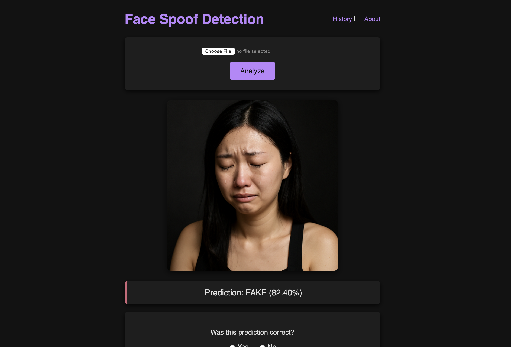
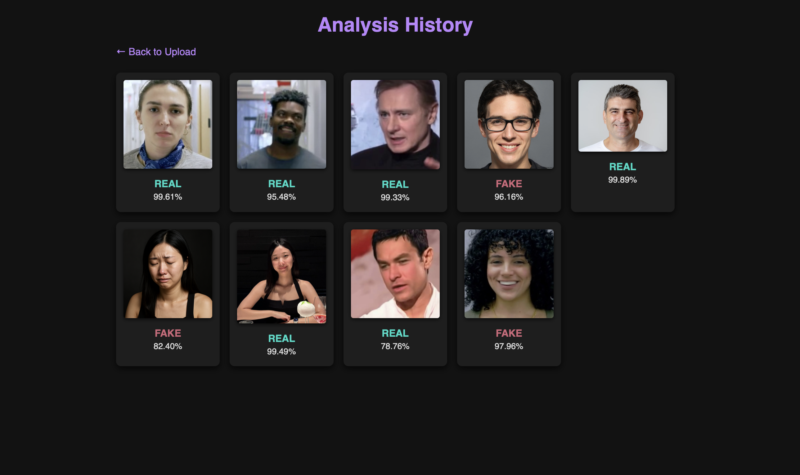

# Face Spoof Detection

An interactive **Flask** web application for image-based face anti-spoofing. Simply upload any face photo and the app fuses multiple visual cues—texture, depth, facial patches, and boundary consistency—to classify your image as **REAL** or **FAKE**.

```bash
cd spoof-detection-app
python app.py
```

Navigate to `http://localhost:5001` for the UI, and ensure the Flask backend (`python app.py`) runs on port 5001.

---

## ✨ Features

* **Texture Analysis**: CLAHE + multi-scale Sobel filters → ResNet18
* **Facial Patches**: Eyes, nose, mouth, cheeks, forehead via MediaPipe
* **Depth Estimation**: Intel MiDaS transformer for 3D consistency
* **Boundary Analysis**: Contour gradients catch blending artifacts
* **Feedback Loop** After analysis, users can submit feedback if the prediction was incorrect. Results will be saved in JSON, which can be used to augment your model’s training dataset.
* **History**: Your uploads & results saved in JSON
* **Dark Mode UI**: Sleek, modern design with loading animation

---

## 📦 Installation

1. **Clone the repo**

   ```bash
   git clone https://github.com/your-org/face-spoof-detector.git
   cd face-spoof-detector
   ```
2. **Backend setup**

   ```bash
   python3 -m venv venv && source venv/bin/activate
   pip install -r requirements.txt
   ```
   
3. **Run everything**

   `python app.py`

> The MiDaS model weights auto-download on first inference.

---

## 🏗️ Project Structure

```
spoof-detection-app/
├── model/
│   ├── improved_deepfake_detector.pth       # Trained PyTorch model
│   └── inference.py                         # Model inference logic
├── static/
│   ├── uploads/                             # Stores uploaded files
│   │   ├── counter.txt
│   │   ├── false_negatives.json
│   │   ├── false_positives.json
│   │   ├── history.json
│   │   ├── group4.png
│   │   └── walker.gif
├── templates/
│   ├── index.html                           # Home page
│   ├── about.html                           # About the project
│   └── history.html                         # Detection history
├── app.py                                   # Main Flask application
├── requirements.txt                         # Python dependencies
├── README.md                                # Project documentation
└── init.py                              # Package initialization       
```

---

## 📸 Sample Web Page Screenshots
### RESULT

<p align="center">
  

History

   
  
</p>

----
